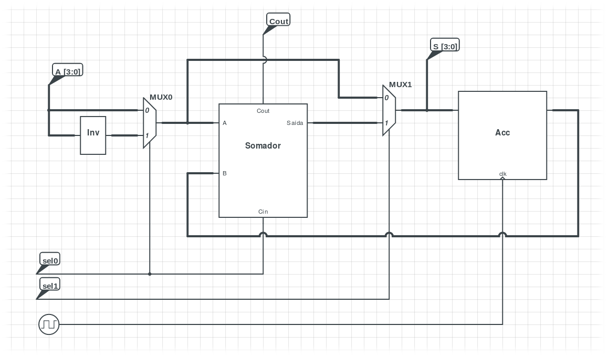

# Concepção Estruturada de Circuitos Integrados: Somador/Subtrator de 4 Bits com Acumulador
Aluno: Victor Franco Vieira Lima, 2017.

## Introdução

Esse projeto foi criado para a disciplina de Concepção Estruturada de Circuitos Integrados, ministrada pelo Prof. Antonio Carlos Cavalcanti, no período 2017.1, UFPB. A disciplina teve como objetivo gerar um circuito somador/subtrador de 4 bits com acumulador totalmente funcional, seguindo a filosofia Top Down, partindo do *Modelo de Referência de Ouro* até o circuito completo. Nesse projeto utilizamos o sistema operacional Fedora, o sistema de versionamento Git, a ferramenta GNU Make e o pacote [Alliance](https://soc-extras.lip6.fr/en/alliance-abstract-en/).

A suite de testes pode ser executada rodando o seguinte comando no diretório raiz do projeto:

    $ make test

### Diagrama do Somador/Subtrator de 4 Bits com Acumulador



O circuito possui apenas três entradas, que são a entrada de valores de 4 bits `A` e os os seletores de modo de operação `sel0` e `sel1`, com 1 bit cada, e duas saídas, que são a saída de 4 bits da operação atual `S` e o indicador de overflow
`Cout`, que é ativado toda vez que uma operação resulta em um número maior que 4 bits.

| sel0 | sel1 | Resposta                         | Operação         |
|------|------|----------------------------------|------------------|
| 0    | 0    | Copia A para ACC                 | `ACC <= A`       |
| 0    | 1    | Soma A com ACC e grava em ACC    | `ACC <= ACC + A` |
| 1    | 0    | Copia Inv(A) para ACC            | `ACC <= Inv(A)`  |
| 1    | 1    | Subtrai A de ACC e grava em ACC  | `ACC <= ACC - A` |


### Organização do Projeto

A organização do código foi feita de acordo com o livro *A Top Down Approach To IC Design*, escritp por Chris Browy, Glenn Gullikson e Mark Indovina, onde temos a seguinte estruturação do código:

* `bin`: Arquivos binários e scripts para a automatização das etapas de produção e verificação do circuito
* `etc`: Arquivos de configuração do simulador
* `include`: Arquivos de código compartilhados
* `src`: Arquivos de código
  * `c`: Código em C
  * `vhdl`: Código em VHDL
* `test`: Arquivos resultantes de testes, como tabelas verdade
* `work`: Arquivos sendo trabalhados por scripts


### Documentação do Projeto

A Documentação do código está escrita no próprio código através de comentários antes de cada operação importante. Para fins de conveniência os trechos mais importantes de código serão copiados e colados aqui conforme a necessidade deles.


## Modelo de Referência de Ouro

O Modelo de Referência de Ouro, do inglês *Golden Reference Model*, trata-se de um modelo de referência em alto nível de um dado circuito capaz de descrever seu comportamento, isto é, suas saídas, em função das suas entradas. Esse modelo é
usado para produzir um vetor de casos de teste que exaustivamente compara se o resultado produzido pelo circuito está de acordo com o vetor de testes gerado.

Neste trabalho, fizemos um modelo em alto-nível em C99, que, uma vez executado, gera os vários vetores de teste para cada um dos componentes do circuito.

### Verificação do Circuito

A verificação do circuito é feita utilizando a ferramenta **Genpat**, do pacote alliance, que gera proceduralmente as suites de teste para cada componente do circuito. A suite de testes pode ser encontrada no diretório [`src/c/`](src/c/),
onde cada componente, definido em [`include/c/`](include/c/), é instanciado e exaustivamente iterado para gerar uma suite de testes eficiente e correta para testar a corretude do circuito final.

#### Exemplo de Modelo de Referência de Ouro:

[`include/c/mux_4bits.h`](include/c/mux_4bits.h)
```c
int Mux4Bits(uint8_t c, uint8_t a, uint8_t b) {
	return (c & 0x1) == 0 ? (a & 0xF) : (b & 0xF);
}
```

Primeiro definimos uma função em C99 capaz de simular corretamente o funcionamento de um Mux de 4 bits, como mostrado acima. Essa função, dependendo da variável de controle `c`, chaveia sua saída entre as entradas de 4 bits `a` e `b`, de
tal forma que caso `c` seja 0, então o mux retorna `a`, caso contrário, retorna `b`.

Note que é aplicado uma máscara `0xF` nas entradas para garantir que apenas os primeiros 4 bits da variável de 8 bits estão sendo usados, já que nesse projeto só estamos trabalhando com um circuito de 4 bits.

#### Exemplo de Arquivo Genpat

[`src/c/mux_4bits.h`](src/c/mux_4bits.h)
```c
#include "genpat.h"

#include <util.h>
#include <mux_4bits.h>

static int current = 0;

int main(void) {
	DEF_GENPAT("mux_4bits");

	DECLAR("A",    ":1", "B", IN,  "(3 downto 0)", "");
	DECLAR("B",    ":1", "B", IN,  "(3 downto 0)", "");
	DECLAR("Ctrl", ":1", "B", IN,  "", "");
	DECLAR("S",    ":1", "B", OUT, "(3 downto 0)", "");

	DECLAR("vdd", ":1", "B", IN, "", "");
	DECLAR("vss", ":1", "B", IN, "", "");
	AFFECT("0", "vdd", "1");
	AFFECT("0", "vss", "0");

	for (int a = 0; a < 16; a++)
 	for (int b = 0; b < 16; b++)
 	for (int c = 0; c <= 1; c++) {
 		int res = Mux4Bits(c, a, b);

		AFFECT(IntToStr(current), "A",    IntToStr(a));
		AFFECT(IntToStr(current), "B",    IntToStr(b));
 		AFFECT(IntToStr(current), "Ctrl", IntToStr(c));
		AFFECT(IntToStr(current), "S",    IntToStr(res));

 		++current;
 	}

	SAV_GENPAT();

	return 0;
}
```

O funcionamento do arquivo é bem simples: primeiro definimos o nome do arquivo que será gerado com os vetores de teste usando a função `DEF_GENPAT`. Nesse caso o nome do arquivo será `mux_4bits.pat` (a extensão `.pat` é colocada automaticamente pelo Genpat). Depois, declaramos os sinais do circuito com a função `DECLAR`, que são suas entradas e saídas dele. Uma vez com as saídas prontas, usamos a função `AFFECT` para determinar o comportamento desses sinais de acordo com a progressão do tempo da simulação. E, por fim, salvamos o arquivo usando a função `SAV_GENPAT`. A documentação do Genpat será explicada mais abaixo, no próximo capítulo.

#### Exemplo de arquivo pat

Para o circuito acima, o `mux_4bits`, temos o seguinte vetor de testes produzido
pelo Genpat:

```
-- description generated by Pat driver

--          date     : Fri Oct 20 19:43:37 2017
--          revision : v109

--          sequence : mux_4bits

-- input / output list :
in       a (3 downto 0) B;;
in       b (3 downto 0) B;;
in       ctrl B;;
out      s (3 downto 0) B;;
in       vdd B;;
in       vss B;;

begin

-- Pattern description :

--                        a    b    c  s    v v  
--                                  t       d s  
--                                  r       d s  
--                                  l            


-- Beware : unprocessed patterns

<          0 ps>        : 0000 0000 0 ?0000 1 0 ;
<          1 ps>        : 0000 0000 1 ?0000 1 0 ;
<          2 ps>        : 0000 0001 0 ?0000 1 0 ;
<          3 ps>        : 0000 0001 1 ?0001 1 0 ;
<          4 ps>        : 0000 0010 0 ?0000 1 0 ;
<          5 ps>        : 0000 0010 1 ?0010 1 0 ;
<          6 ps>        : 0000 0011 0 ?0000 1 0 ;
<          7 ps>        : 0000 0011 1 ?0011 1 0 ;
<          8 ps>        : 0000 0100 0 ?0000 1 0 ;
<          9 ps>        : 0000 0100 1 ?0100 1 0 ;
<         10 ps>        : 0000 0101 0 ?0000 1 0 ;
<         11 ps>        : 0000 0101 1 ?0101 1 0 ;
<         12 ps>        : 0000 0110 0 ?0000 1 0 ;
... ETC
```

Cada coluna representa um valor e como ele deve variar. Os valores de entrada são enviados à simulação e compararemos os valores de saída do vetor com os valores de saída da simulação. Se forem iguais, então o circuito está funcionando
corretamente.

### Documentação do Genpat

A documentação do Genpat pode ser resumida à essas quatro funções que foram usadas para gerar o vetor acima:

* `DEF_GENPAT(nome)`
  Define o nome do arquivo de saída gerado pelo genpat
* `DECLAR(ident, spc, form, mode, size, opt)`
  Declara as entradas esaídas para o circuito usando os seguintes parâmetros:
  * `ident`: Identificador do sinal
  * `spc`: Espaçamento entre cada coluna de sinal
  * `mode`: Tipo de sinal (entrada `IN` ou saída `OUT`)
  * `size`: Largura do barramento
  * `opt`: Opção extra (não utilizado)
* `AFFECT(date, ident, value)`
  Altera o estado de um determinado sinal. O estado é mantido até o final da execução ou até ser sobreescrito por outra chamada do AFFECT. Parâmetros:
  * `date`: Tempo relativo ou absoluto que indica quando o sinal será modificado
  * `ident`: Identificador do sinal
  * `value`: Novo valor do sinal
* `SAV_GENPAT()`
  Salva o arquivo pat.

## Programação VHDL
### Introdução
Uma vez com o Modelo de Referência de Ouro feito, agora vamos começar a implementar os componentes em VHDL que compõem o circuito. Eles podem ser encontrados na pasta [`src/vhdl/`](src/vhdl), como especificado na Organização do Projeto.

### VHDL Alliance

Devido a uma limitação do Alliante, os códigos VHDL primeiro precisam ser processados pelo *Vasy*, para gerar um subset do VHDL que é compreendido por ele, que tem extensão `vst` para implementações Estruturais e `vbe` para implementações Comportamentais. O funcionamento dessa ferramenta é simples,
basta executar o comando:

    $ vasy -a -o circuito_vhdl_entrada circuito_vst_ou_vbe_saida

Por exemplo, para o arquivo [`somador_1bit.vhdl`](src/vhdl/somador_1bit.vhdl), com o seguinte código:

```vhdl
library IEEE;
use IEEE.STD_LOGIC_1164.all;

-- Somador de 1 bit
entity somador_1bit is
	port (
		a, b, cin : in  std_logic;
		s, cout   : out std_logic;
		vdd       : in  std_logic;
		vss       : in  std_logic
	);
end somador_1bit;

-- Implementacao do Somador de 1 bit
architecture structural of somador_1bit is
begin
	s    <= a xor b xor cin;
	cout <= (a and b) or (a and cin) or (b and cin);
end structural;
```

Rodaremos o seguinte código:

    $ vasy -a -o somador_1bit somador_1bit_vasy

Que gerará o arquivo `somador_1bit_vasy.vbe`:

```vhdl
--
-- Generated by VASY
--
ENTITY somador_1bit IS
PORT(
  a : IN BIT;
  b : IN BIT;
  cin   : IN BIT;
  s : OUT BIT;
  cout  : OUT BIT;
  vdd   : IN BIT;
  vss   : IN BIT
);
END somador_1bit;

ARCHITECTURE VBE OF somador_1bit IS

BEGIN

  cout <= (((a AND b) OR (a AND cin)) OR (b AND cin));
  s <= ((a XOR b) XOR cin);
END VBE;
```


Esse processo é rodado para cada VHDL do projeto, preparando-os para a próxima etapa:


### Simulação do Circuito

A simulação do circuito é feita pelo programa *Assimut*, do pacote Alliance. O funciomaneot do asismut é simples: dado um componente `vbe` ou `vst` e um vetor de testes `pat`, ele simula o circuito e retorna a corretude do circuito.

Para circuitos Comportamentais `vbe` que não dependam de outros circuitos, basta executar:

    $ asimut -b circuito_vbe vetor_de_testes_pat resultado

E ele automaticamente dirá se o circuito está correto ou não.

Para circuitos Estruturais `vst`, o funcionamento muda um pouco. Primeiro precisaremos definir um arquivo `catalog` com as dependências desse circuito listadas. No caso do somador de 4 bits, que é feito usando quatro somadores de um bit, foi feito o seguinte arquivo catalog:

```
somador_1bit C
```


&& MBK_CATAL_NAME=catalog MBK_IN_LO=vst asimut somador_4bits{,} result \
